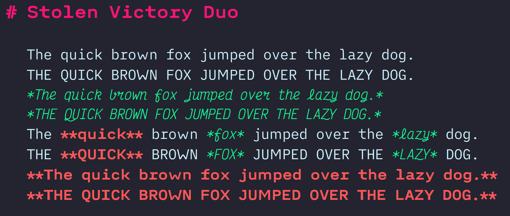

# Stolen Victory Duo

A mash up of [iA Writer Duospace](https://github.com/iaolo/iA-Fonts/tree/master/iA%20Writer%20Duospace) with italics from [Victor Mono](https://rubjo.github.io/victor-mono/).

## Notes

This is a variable width font. You can read more at [In Search of the Perfect Writing Font](https://ia.net/topics/in-search-of-the-perfect-writing-font) about iA Writer Duospace.

The family name is `Stolen Victory Duo`. It's designed for writing and not recommended for applications where mono-spaced fonts are required. Stick to [Victor Mono](https://rubjo.github.io/victor-mono/) for that.

[iA Writer Duospace](https://github.com/iaolo/iA-Fonts/tree/master/iA%20Writer%20Duospace) has been adjusted to have softer curves in characters. The hope is to maintain the readability, cleanliness, and digital authenticity of the original Duospace. The adjustments are to provide a warmer and more inviting writing space. The differences are minor, but we hope you can see and appreciate the subtle changes.

[Victor Mono](https://rubjo.github.io/victor-mono/) was chosen for the italics. There are currently no changes other than a rename for the italics to appear when using the font family. People should not feel like they're learning a programming language when using Markdown. In discussions with users, many want a better visual indicator that their formatting is correct while using Minimal/Monocolor Themes. The Italics of Victor Mono capture the welcoming feeling we want to capture. Victor Mono Regular is great for writing code, but we believe iA Writer Duospace lent itself better to stories.
